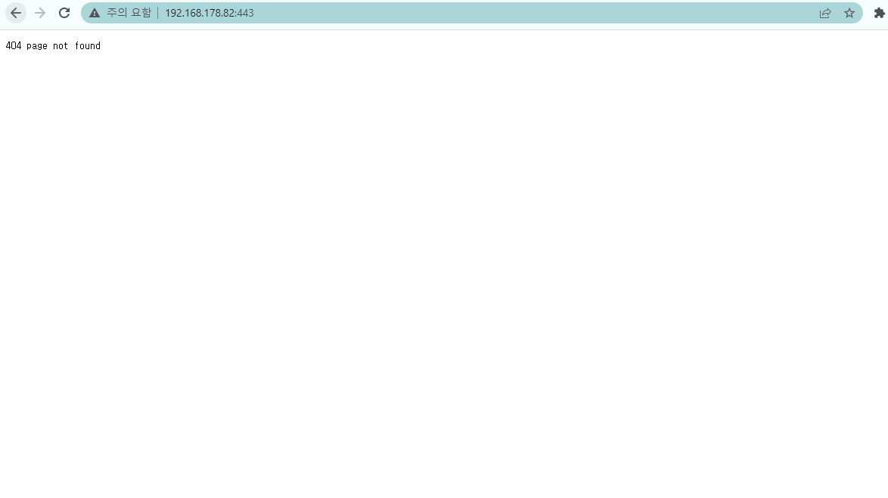

# API-GATEWAY 설치 가이드

## Contents
- [구성 요소](#구성-요소)
- [Prerequisites](#prerequisites)
- [설치 가이드](#설치-방법)
- [동작 확인](#동작-확인)
- [설치 리소스 제거](#설치-리소스-제거)

## 구성 요소
* traefik ([traefik/traefik](https://hub.docker.com/r/library/traefik/tags))
* hypercloud-console ([tmaxcloudck/hypercloud-console](https://hub.docker.com/r/tmaxcloudck/hypercloud-console/tags))
* jwt-decode ([tmaxcloudck/jwd-decode](https://hub.docker.com/r/tmaxcloudck/jwt-decode/tags))
* 가이드 작성 시점(2021/12/17) 최신 버전은 아래와 같습니다. 
    * traefik:v2.5.4
    * hypercloud-console:5.0.42.5
    * jwt-decode:5.1.0.1

## Prerequisites
* Kubernetes, cert-manager가 설치 되어 있어야 합니다.
  * hyperauth를 api-gateway가 설치된 클러스터에 ingress로 생성할 경우, [설치 순서](#설치-순서) 1-3을 완료 후 hyperauth 설치를 진행하세요. 
  * ingress주소로 hyperauth에 접속 됨을 확인한 후, hyperauth, realm, clientid를 입력 한 후 [설치 순서](#설치-순서) 4-7를 진행하세요. 
* console 원할한 접속을 위해 hyperauth (Keycloak), HyperCloud api servier, Prometheus가 설치되어 있어야 합니다.
* 온전한 화면을 위해 추가로 grafana, istio(Kiali, Jaeger), kibana, kubeflow, gitlab 설치가 추가로 필요합니다.
* 추가 모듈은 모두 인그레스로 생성되어 있어야합니다.
* LoadBalancer 타입에 사용할 IP 여유분이 1개 있어야합니다. 
  * IP 여유분이 없을 경우 NodePort 타입으로 서비스를 생성해야합니다. (이 경우, ingress 조회 시 address가 나오지 않습니다.)

## 설치 방법
* Makefile.properties 안의 변수를 설정한다. 
  * 변수에 대한 설정은 [환경 변수](#환경-변수)를 참고해주세요. 
* make 명령어를 사용해 필요한 모듈을 설치합니다.
  * 설치 순서는 [설치 순서](#설치-순서)를 참고해주세요. 

### 환경 변수
* GATEWAY의 서비스 타입 변수

이름 | 내용 | 기본값  
| --- | --- | ---
| SERVICE_TYPE | GATEWAY 의 서비스 타입 (LoadBalancer, NodePort, ClusterIP) | LoadBalancer 

* GATEWAY의 기본 TLS 인증서 생성에 필요한 변수

이름 | 내용 | 기본값
| --- | --- | ---
| DEFAULT_TLS_TYPE | GATEWAY 의 기본 TLS 인증서 타입 (acme, nip_io, selfsigned, none) | selfsigned 
| DOMAIN_NAME | GATEWAY 의 도메인 이름 설정 | localhost 
| EMAIL | DEFAULT_TLS_TYPE=acme 로 설정했을 때 acme 프로토콜에 필요한 메일 주소 (도메인 발급 기관은 aws route53)| tmaxcloud\@tmax.co.kr 
| ACCESS_KEY_ID | DEFAULT_TLS_TYPE=acme 로 설정했을 때 acme 프로토콜에 필요한 ACCESS_KEY_ID (도메인 발급 기관은 aws route53) | NULL 
| SECRET_ACCESS_KEY | DEFAULT_TLS_TYPE=acme 로 설정했을 때 acme 프로토콜에 필요한 SECRET_ACCESS_KEY (도메인 발급 기관은 aws route53) | NULL

* GATEWAY에 필요한 이미지 설정 변수

이름 | 내용 | 기본값
| --- | --- | ---
| REGISTRY | 이미지 저장소 | docker.io
| TRAEFIK_VERSION | gateway의 핵심 모듈인 traefik 이미지 버전 | v.2.5.4 
| CONSOLE_VERSION | hypercloud-console 이미지 버전 | 5.0.40.0
| JWT_VERSION | jwt 토큰 검증에 사용되는 이미지 버전 | 5.0.0.1 

* HYPERAUTH와 연결에 사용되는 변수

이름 | 내용 | 기본값
| --- | --- | ---
| HYPERAUTH | hyperauth 주소 | hyperauth.org 
| REALM | token 발급에 필요한 realm 이름 | tmax  
| CLIENT_ID | token 발급에 필요한 client id 이름 | hypercloud5 

* CONSOLE 설정 변수

이름 | 내용 | 기본값
| --- | --- | ---
| CONSOLE | 콘솔 접근 주소 | console 
| MC_MODE | 멀티 클러스터(MC_MODE=true), 싱글 클러스터 설정(MC_MODE=false) | true

## 설치 순서 
#### 아래 명령어를 순서에 맞게 입력해야합니다

```bash
# 0.. Github 파일과 make를 다운로드합니다
yum install make -y
git clone https://github.com/learncloud/install-console-5.0.git
cd install-console-5.0/

# (필수) 1. Makefile.properties 수정 (아래그림 참고)
# 위 파일내 변수 변경이 필수
vi Makefile.properties


# 2.설치에 사용될 temp 폴더 생성
make dir.build

# 3. 네임스페이스, traefik crd, ca 인증서 생성
make init.build
make init.apply

# 4. traefik 생성
make traefik.build
make traefik.apply

## 아래 순서부턴 hyperauth 주소, realm, client가 있어야 진행이 가능합니다

# 5. Gateway의 Default 인증서 생성
make tls.build

make tls.apply

# 6. jwt-decode-auth 생성
make jwt.build
make jwt.apply

# 7. console 생성
make console.build
make console.apply


# 8. ingressroutes 생성
make ingressroute.build
make ingressroute.apply


# 9. HyperAuth 어드민 페이지에서 ReDirection을 반드시 진행 (아래그림 참고)

192.168.178.81:443 접속
#rootURL과 AdminURL에 반드시 기재해줘야함
https://console.192.168.178.82.nip.io:443

```

* 위 1번 설치시, 참고할 스크린샷
   

* 위의 9번 설치시 후, yaml부분에서 코드 최적화가 되지않아 404error가 발생할 경우 참고할 스크린샷
   * makefile 설치 직후 화면
   
   
   * makefile 설치 이외 404 error를 없애기 위한 설정
   
   
   
   


## 동작 확인 
#### 아래 명령어로 traefik, console 정상 동작 확인 
`kubectl -n api-gateway-system get pods`
#### 아래 명령어로 console 접근 주소 확인 
`kubectl get ingressroute -n api-gateway-system console-ingressroute -o jsonpath='{@.spec.routes[0].match}' | awk '{print $6}'`
#### 조회된 주소로 접근하여 정상 동작 확인  

## 설치 리소스 제거 
#### 아래 명령어를 순서에 맞게 입력
1. `make ingressroute.delete`
2. `make console.delete`
3. `make jwt.delete`
4. `make tls.delete`
5. `make traefik.delete`
6. `make init.delete`
